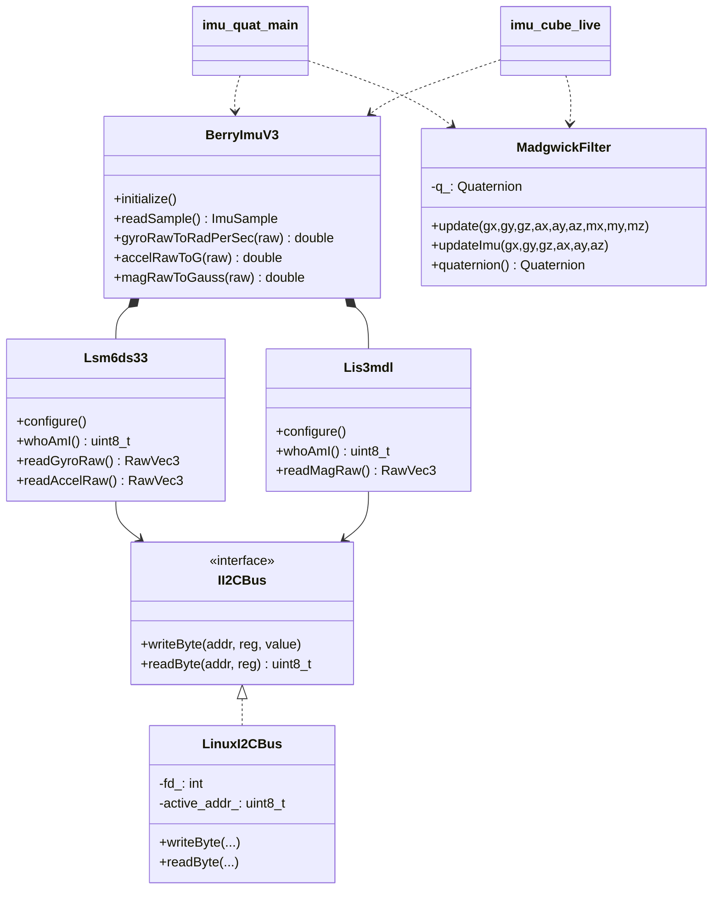

# IMU Processing + Quaternion Visualization (Project 2)

This repository now contains a full C++ solution for the project requirements:

- IMU hardware abstraction layer (HAL) for BerryIMU v3 sensors (`LSM6DS33` + `LIS3MDL`).
- Madgwick AHRS sensor-fusion implementation.
- Terminal quaternion output program.
- Live OpenGL cube driven by real-time quaternions.
- Existing raw I2C reader retained and documented.

## File Overview

- `code.cpp`
- `cube_quat.cpp`
- `imu_hal.hpp`, `imu_hal.cpp`
- `madgwick_filter.hpp`, `madgwick_filter.cpp`
- `imu_quat_main.cpp`
- `imu_cube_live.cpp`
- `Makefile`

## How Your Existing `code.cpp` Works

`code.cpp` is a direct Linux I2C implementation (procedural style):

- Opens `/dev/i2c-1` with `open()`.
- Selects the active slave with `ioctl(..., I2C_SLAVE, addr)`.
- Writes sensor configuration registers for `LSM6DS33` (gyro + accelerometer) and `LIS3MDL` (magnetometer).
- Reads each axis as 16-bit little-endian data by combining low/high 8-bit registers.
- Streams raw values (`Gx Gy Gz`, `Ax Ay Az`, `Mx My Mz`) to terminal.

This is a good low-level base and is now wrapped into OOP HAL classes in the new files.

## New Code Architecture

### 1) HAL Layer (`imu_hal.*`)

- `II2CBus`: abstract interface for I2C reads/writes.
- `LinuxI2CBus`: Linux `/dev/i2c-*` implementation.
- `Lsm6ds33`: sensor-specific class for gyro/accel configuration and raw reads.
- `Lis3mdl`: sensor-specific class for magnetometer configuration and raw reads.
- `BerryImuV3`: composes both sensors and returns one 9-DoF sample with raw + scaled values.

Physical unit conversion used:

- Gyro (`+/-500 dps`): `0.0175 dps/LSB`, converted to `rad/s`.
- Accel (`+/-2 g`): `0.000061 g/LSB`.
- Mag (`+/-4 gauss`): `6842 LSB/gauss`, converted to `gauss`.

### 2) Sensor Fusion (`madgwick_filter.*`)

- `MadgwickFilter` class with `update(...)` for full MARG update, `updateImu(...)` fallback, and internal quaternion state `q = [w, x, y, z]`.

This implements the gradient-descent-based AHRS approach from Madgwick.

### 3) Terminal Quaternion App (`imu_quat_main.cpp`)

- Initializes IMU through HAL.
- Runs Madgwick at configured frequency.
- Prints quaternion continuously as `q = [w x y z] = ...`.

Useful options:

- `--device /dev/i2c-1`
- `--hz 100`
- `--beta 0.10`
- `--samples N`
- `--print-raw`

### 4) Live 3D Viewer (`imu_cube_live.cpp`)

- Starts a sensor thread that reads IMU data, updates Madgwick, and publishes current quaternion.
- OpenGL/FreeGLUT thread renders a cube using quaternion -> rotation matrix conversion.
- Supports real IMU mode (default) and `--simulate` mode for desktop testing without hardware.

### 5) Manual Viewer (`cube_quat.cpp`)

- Standalone quaternion-driven cube for quick tests.
- Accepts initial quaternion from CLI or keyboard controls.
- Not connected to IMU by itself.

## Build

Install dependencies first (Raspberry Pi / Ubuntu):

```bash
sudo apt update
sudo apt install -y g++ libi2c-dev freeglut3-dev mesa-utils
```

From repository root:

```bash
cd project-1-team_baaa
make
```

If you get linker errors on Raspberry Pi, try:

```bash
make clean
make GL_LIBS="-lglut -lGL -lGLU -lX11"
```

## Run

### 1) Raw I2C stream (your original code)

```bash
g++ -std=c++17 -O2 code.cpp -o raw_i2c
sudo ./raw_i2c
```

### 2) Quaternion output in terminal (Task 1)

```bash
sudo ./imu_quat --hz 100 --beta 0.10
```

Example with finite sample count:

```bash
sudo ./imu_quat --samples 200 --print-raw
```

### 3) Real-time IMU cube visualization (Task 2)

```bash
sudo ./imu_cube_live --hz 100 --beta 0.10
```

Desktop-only simulation mode:

```bash
./imu_cube_live --simulate
```

### 4) Standalone quaternion cube test

```bash
./cube_quat
./cube_quat 0.9239 0 0.3827 0
```

## UML Class Diagram (Textual)



## Notes

- On Raspberry Pi you usually need `sudo` to access `/dev/i2c-1`.
- Enable I2C first (`raspi-config`) if disabled.
- Expected `WHO_AM_I`: `LSM6DS33 = 0x69`, `LIS3MDL = 0x3D`.

