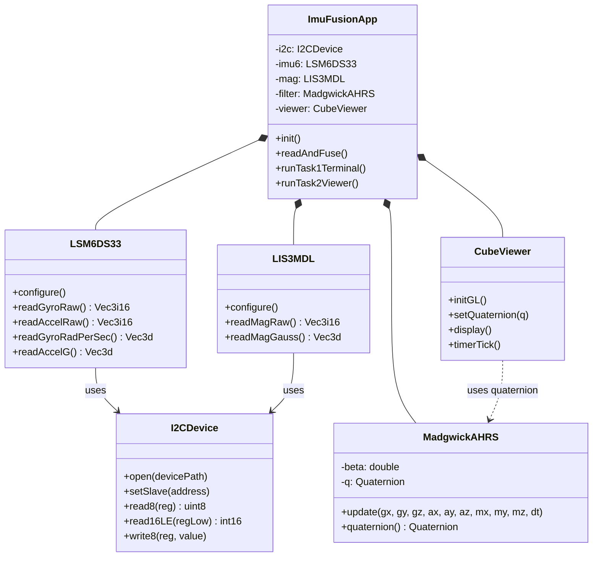

# Task 3 UML Class Diagram

```mermaid
classDiagram
    class I2CDevice {
      +open(devicePath)
      +setSlave(address)
      +read8(reg) uint8
      +read16LE(regLow) int16
      +write8(reg, value)
    }

    class LSM6DS33 {
      +configure()
      +readGyroRaw() Vec3i16
      +readAccelRaw() Vec3i16
      +readGyroRadPerSec() Vec3d
      +readAccelG() Vec3d
    }

    class LIS3MDL {
      +configure()
      +readMagRaw() Vec3i16
      +readMagGauss() Vec3d
    }

    class MadgwickAHRS {
      -beta: double
      -q: Quaternion
      +update(gx, gy, gz, ax, ay, az, mx, my, mz, dt)
      +quaternion() Quaternion
    }

    class CubeViewer {
      +initGL()
      +setQuaternion(q)
      +display()
      +timerTick()
    }

    class ImuFusionApp {
      -i2c: I2CDevice
      -imu6: LSM6DS33
      -mag: LIS3MDL
      -filter: MadgwickAHRS
      -viewer: CubeViewer
      +init()
      +readAndFuse()
      +runTask1Terminal()
      +runTask2Viewer()
    }

    LSM6DS33 --> I2CDevice : uses
    LIS3MDL --> I2CDevice : uses
    ImuFusionApp *-- LSM6DS33
    ImuFusionApp *-- LIS3MDL
    ImuFusionApp *-- MadgwickAHRS
    ImuFusionApp *-- CubeViewer
    CubeViewer ..> MadgwickAHRS : uses quaternion
```
